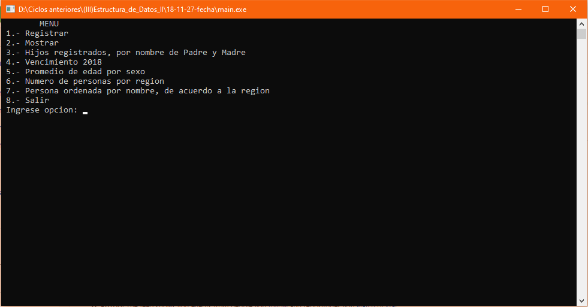

# Control de personas v2
Sistema de control de personas que permite ingresar los datos de una persona, mostrar estos datos, mostrar las personas según el nombre de su padre y madre, mostrar las personas que vence su DNI el año 2018, mostrar el promedio de edades por sexo, mostrar la cantidad de personas por región, según la región muestra las personas ordenadas por su nombre, **27/11/18**.

<strong>Imagen:</strong> Menú principal.

